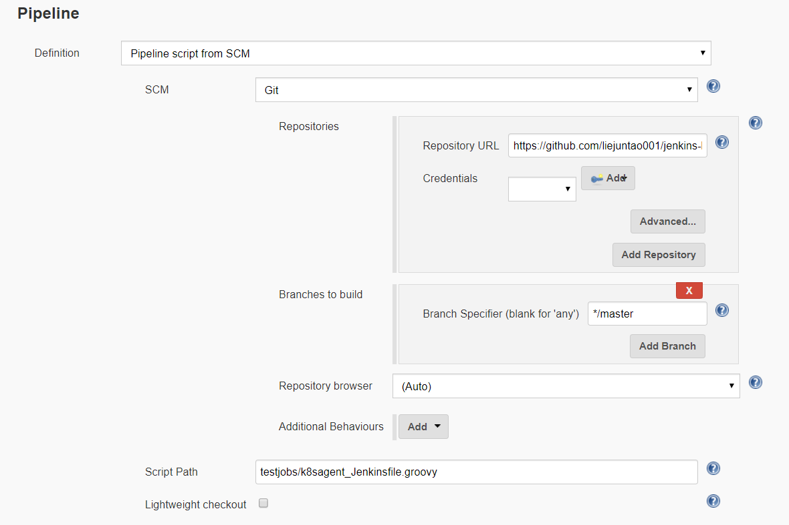

# Jenkins Shared Library to get dynamic agent from Kubernetes cloud

This is a Jenkins Shared Library to get a dynamic agent from Kubernetes cloud.

Define the required agent in format "a+b+c", for example, "small+pg+privileged" to get an agent of "small size, additional postgres container and jnlp container running in privileged mode".  
It's flexible to add templates in folder [resources/podtemplates](./resources/podtemplates). The yaml files will be merged together and passed to [Kubernetes Plugin](https://plugins.jenkins.io/kubernetes) to launched the desired pod.

Below lines will get an agent with 2 containers in the pod, a JNLP container of "mini" size plus a "postgres" container.

```
pipeline {
  agent {
    kubernetes(k8sagent(name: 'mini+pg'))
  }
  stages {
    stage('demo') {
      steps {
        echo "this is a demo"
        script {
          container('pg') {
            sh 'su - postgres -c \'psql --version\''
          }
        }
      }
    }
  }
}
```

A more sophisticated example is [here](./testjobs/k8sagent_Jenkinsfile.groovy), where you could decide the agent type with more complex logic.


# Preconditionl

* Running Kubernetes cluster
* Jenkins server with connection to the cluster
* [Kubernetes Plugin](https://plugins.jenkins.io/kubernetes) installed on the Jenkins

The Jenkins server could be stand-alone or be running inside the Kubernetes cluster.

# Usage 
### **Recommended** Method 1 - Import into Jenkins 
Import the library following the [instruction](https://jenkins.io/doc/book/pipeline/shared-libraries/)


Use it in pipeline
```
@Library("k8sagent") _
```

### Method 2 - Load dynamically
```
@Library("github.com/liejuntao001/jenkins-k8sagent-lib") _
```
However due to Jenkins security control, multiple methods need get approved.

# Build and test
The library is a gradle project with tests.

```
.
├── build.gradle
├── src
│   └── com
├── test
│   ├── com
│   └── groovy
├── testjobs
│   ├── k8sagent_Jenkinsfile.groovy
│   └── simple_Jenkinsfile.groovy
└── vars
    └── k8sagent.groovy
```

Local build and test

```
./gradlew clean test

> Task :test
K8sAgentTest: testSdk25: SUCCESS
K8sAgentTest: testSmall: SUCCESS
K8sAgentTest: testBase: SUCCESS
K8sAgentTest: testFast: SUCCESS
K8sAgentTest: testPg: SUCCESS
K8sAgentTest: testPrivileged: SUCCESS
Tests: 6, Failures: 0, Errors: 0, Skipped: 0


BUILD SUCCESSFUL in 2s
6 actionable tasks: 5 executed, 1 up-to-date
```

Run the demo in a real Jenkins Job .

